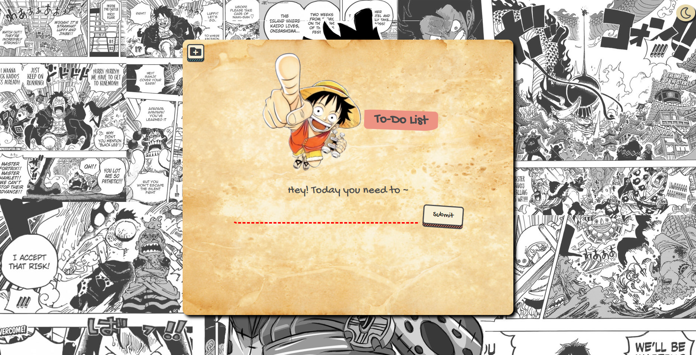
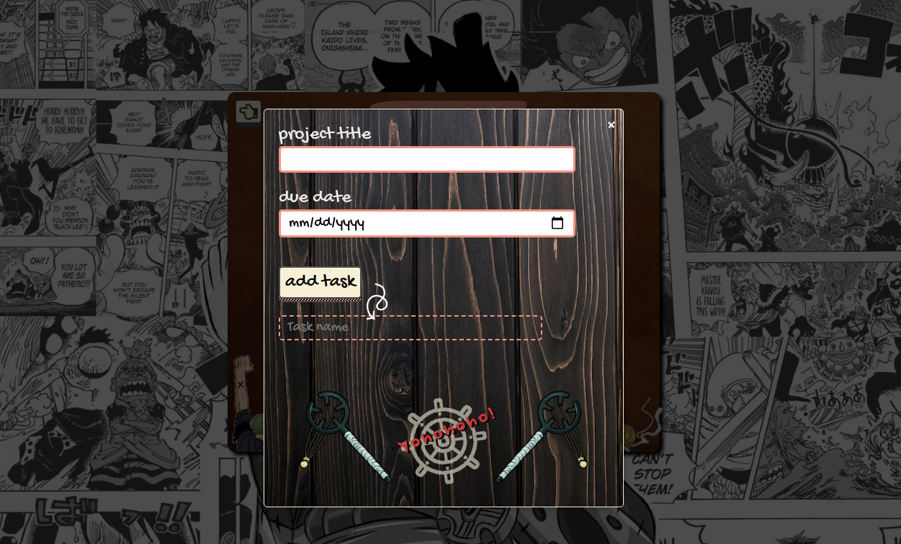

# ToDo Web Application

This web application allows you to manage your tasks and projects efficiently. You can create, edit, and delete your tasks for the day. You can also organize tasks into projects that persist even on browser exit.

# Preview

Check out the live demo [here!](https://innopaolo.github.io/todo-app/)

## Features

- Delete confirmation in the form of a curly strikethrough 
- Flag can be clicked once for normal priority and twice for high priority
- Projects can be expanded to show tasks
- Editable tasks within the projct card itself
- Dark and light themes
- Responsive design for various screen sizes
- Animated wheel button
- Tasks are saved on local storage

## What I learned

1. **LocalStorage**: I learned how to use the LocalStorage API to store and retrieve data locally in a web browser. This allowed me to implement data persistence, ensuring that user data is saved and can be accessed across sessions.

2. **User Interface Design**: I practiced designing a user-friendly and intuitive interface that enhances the user experience and web flow. I focused on creating clear and visually appealing elements.

3. **Project Organization**: I gained experience in organizing code into modular functions and using event listeners to efficiently manage user interactions.

4. **Error Handling**: I learned to implement error handling to provide informative feedback to users and prevent crashes when dealing with data storage.

5. **Theme Switching**: I explored implementing a theme switcher to provide users with visual customization options.

6. **Project Structure**: I practiced with different modules, functions, and components with webpack, making the codebase more maintainable and scalable.

7. **Media Queries**: I focused on a mobile first design and really drilled down on the effective coverage of media queries.

## Struggles

My biggest struggle was when it was time to break up the code into their own separate modules. I had trouble trying to separate certain functions that were tightly coupled, and had to refactor extensively. 

I decided not to merge the webpack version to the main branch, as at the time, I was also having trouble trying to correctly bundle the images together with the code. I would eventually resolve this issue in my subsequent project, the Weather app. It turns out that I simply needed to create a generator property for my asset/resource module in the webpack config file.

My biggest takeaway from my struggles is to focus on creating pure functions from the very beginning (as much as possible) and be conscious of when my code starts straying from the SOLID principle. I would eventually learn in a later project - Battleship - to also focus on test driven development.

## Technologies Used

- 
-    
- 

## Future Enhancements

- 'Today tasks' can be bundled up into a project
- User Authentication
- Ability to set reminders
- Implementing task sorting and filtering
- Data synchronization
- Improved UI/UX

## Acknowledgments

- Gnochi Font from [Google Fonts](https://fonts.google.com/).
- Icons from [Font Awesome](https://fontawesome.com/).
- Manga background from [Wallpapersden](https://wallpapersden.com/).
- Various assets from [here](https://www.pngwing.com/en/free-png-zoyqj), [here](https://custom-cursor.com/en/collection/one-piece/one-piece-usopp-slingshot), and [here](http://www.kindpng.com/free/one-piece-luffy/).

Thank you for reading all the way here. Have a great day! 

